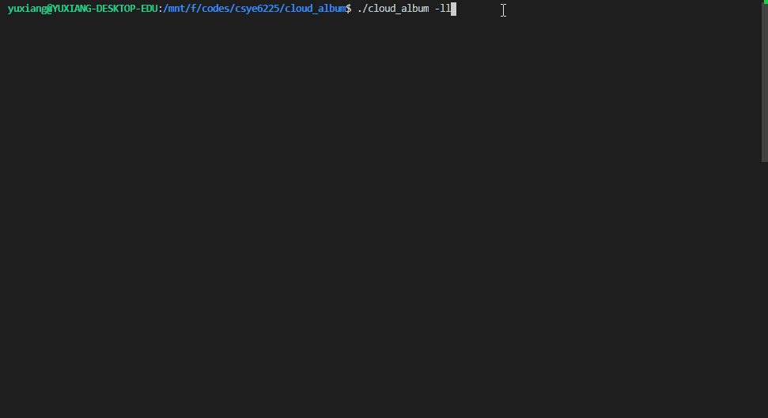

# Cloud Album

## Introduction

This is a simple cloud album CLI program implemented by use AWS S3 service.

You could use this CLI program to upload you image files. And check uploaded files on cloud.

## How to build
```shell
make build
```

## How to use

Usage:

`cloud_album [-f IMG1 IMG2 ...] [-l] [-ll]`

Upload images:
    
`cloud_album -f FILE0 FILE1 ...`
        
List info of images now on cloud

`cloud_album -l`

List detail info of images now on cloud

`cloud_album -ll`


## Demo

